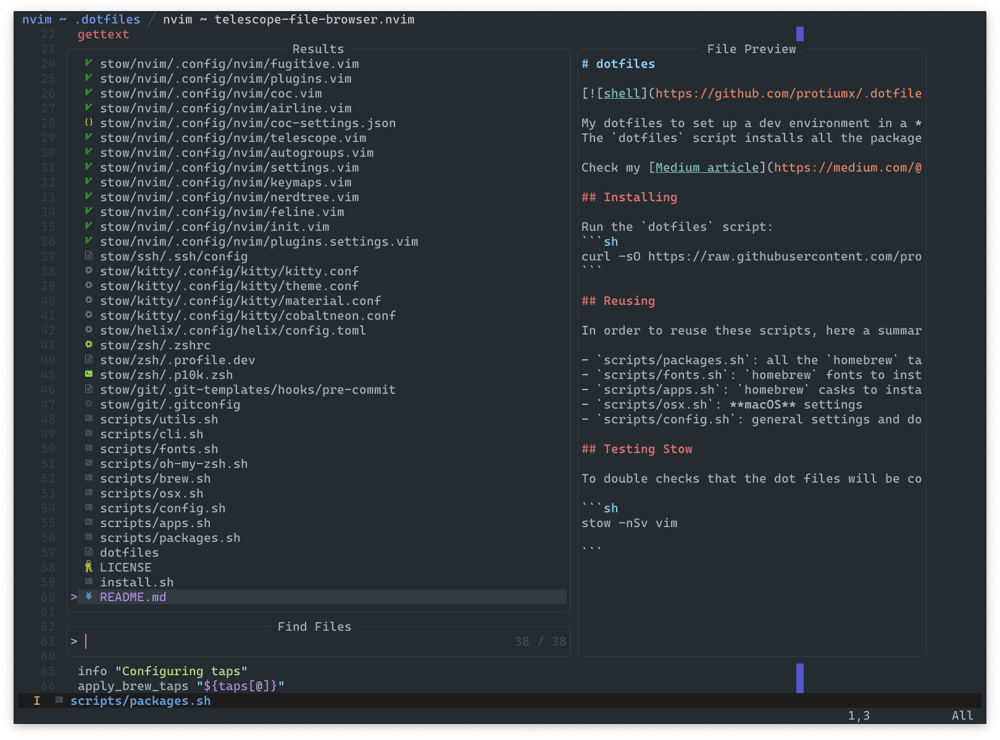
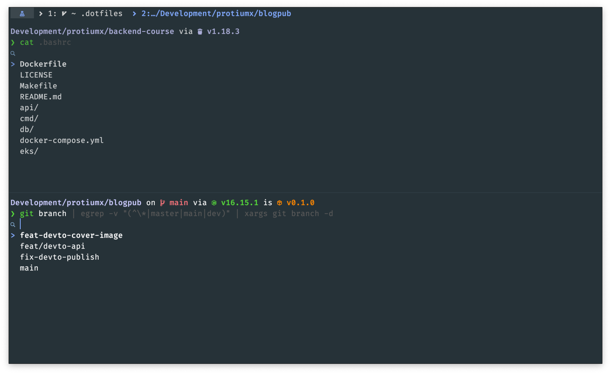

# dotfiles

[](https://github.com/protiumx/.dotfiles/actions/workflows/shell.yml)

My dotfiles to set up a dev environment in a **macOS** machine.
The `dotfiles` script installs all the packages and apps I use, [stow](https://www.gnu.org/software/stow/) my dotfiles and sets all my preffered macOS configurations.

Check my [Medium article](https://medium.com/@protiumx/bash-gnu-stow-take-a-walk-while-your-new-macbook-is-being-set-up-351a6f2f9225).

## Previews





## Installing

Run the `dotfiles` script:
```sh
curl -sO https://raw.githubusercontent.com/protiumx/.dotfiles/main/dotfiles
```

## Reusing

In order to reuse these scripts, here a summary of files you can change/adapt to your needs:

- `scripts/packages.sh`: all the `homebrew` taps and packages to install
- `scripts/fonts.sh`: `homebrew` fonts to install
- `scripts/apps.sh`: `homebrew` casks to install
- `scripts/osx.sh`: **macOS** settings
- `scripts/config.sh`: general settings and dotfiles

## Testing Stow

To double checks that the dot files will be correctly linked, you can use stow to simulate the result. E.g.

```sh
stow -nSv vim

```
